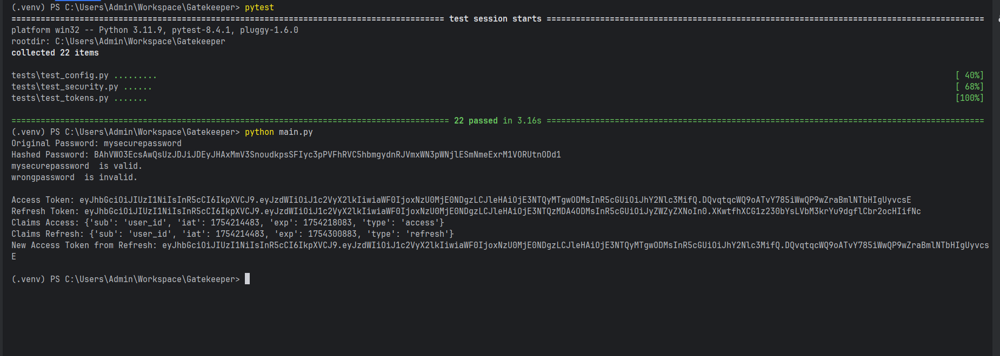

# PyGatekeeper 🔐

**Secure Auth Starts with PyGatekeeper**

PyGatekeeper is a Python-based authentication and access control system designed to provide secure, scalable, and
customizable identity management for modern applications. Whether you're building APIs, web apps, or IoT systems,
PyGatekeeper is your first line of defense.

---

## Features

- ✅ Secure password hashing with bcrypt + random salt
- ✅ JWT-based access and refresh token generation
- ✅ Config-driven validation with environment variable support
- ✅ Stateless authentication
- ✅ Easily extendable for role-based access control (RBAC), OAuth, etc.

---

## Installation

```bash
pip install git+https://github.com/jeetendra29gupta/PyGatekeeper.git
````

Ensure your `.env` or environment variables include:

```env
JWT_SECRET_KEY=your-secret-key
JWT_ALGORITHM=HS256
ACCESS_TOKEN_EXPIRE_MINUTES=15
REFRESH_TOKEN_EXPIRE_HOURS=24
SALT_LENGTH=12
```

---

## Usage

### 🔐 Password Hashing

```python
from pygatekeeper.security import PasswordManager, PasswordError


def password():
    try:
        pm = PasswordManager()

        my_password = "mysecurepassword"
        hashed = pm.hash_password(my_password)
        print(f"Original Password: {my_password}")
        print(f"Hashed Password: {hashed}")

        correct_password = "mysecurepassword"
        assert pm.verify_password(correct_password, hashed)
        if pm.verify_password(correct_password, hashed):
            print(correct_password, " is valid.")

        wrong_password = "wrongpassword"
        assert not pm.verify_password(wrong_password, hashed)
        if not pm.verify_password(wrong_password, hashed):
            print(wrong_password, " is invalid.")

    except PasswordError as e:
        print(f"Password error: {e}")


if __name__ == '__main__':
    password()

```

### 🔑 Token Management

```python
from pygatekeeper.tokens import TokenManager, TokenError


def token():
    try:
        tm = TokenManager()

        access_token = tm.create_access_token("user_id")
        print(f"Access Token: {access_token}")

        refresh_token = tm.create_refresh_token("user_id")
        print(f"Refresh Token: {refresh_token}")

        claims_access = tm.validate_access_token(access_token)
        print(f"Claims Access: {claims_access}")

        claims_refresh = tm.validate_refresh_token(refresh_token)
        print(f"Claims Refresh: {claims_refresh}")

        """
        Validate a refresh token and issue a new access token for the same subject.
        """
        payload = tm.validate_refresh_token(refresh_token)
        subject = payload.get("sub")
        if not subject:
            raise TokenError("Invalid refresh token: missing subject.")
        refresh_access_token = tm.create_access_token(subject)
        print(f"New Access Token from Refresh: {refresh_access_token}")

    except TokenError as e:
        print(f"Token validation error: {e}")


if __name__ == '__main__':
    token()
```

---
> 
---
